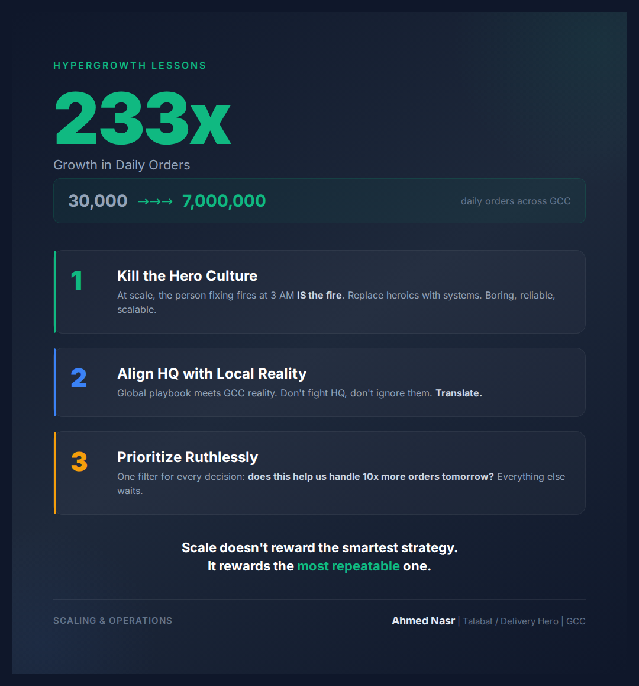

# Thursday February 26 | Growth | SLAY | Sexy | CTA: B

---

We scaled from 30,000 to 7 million orders.

Not in a year. In the time I was there.

At Talabat (now Delivery Hero), I joined when GCC operations were processing 30,000 daily orders. By the time the dust settled, we were handling 7 million. That's 233x growth.

Here's what nobody tells you about hypergrowth:

The product isn't the bottleneck. Operations is.

Three things made 233x possible:

1. We killed the hero culture.
Early stage startups worship the person who stays until 3 AM fixing fires. At scale, that person IS the fire. We replaced heroics with systems. Lean methodologies. Repeatable processes. Boring, reliable, scalable.

2. We aligned Berlin HQ with GCC reality.
Delivery Hero's HQ had a global playbook. GCC markets had different payment preferences, delivery logistics, and customer expectations. My job was bridging that gap on the Operations Excellence Committee. Not fighting HQ, not ignoring them. Translating.

3. We prioritized ruthlessly.
When you're growing 233x, everything feels urgent. The skill isn't doing more. It's choosing what NOT to do. Every feature, every initiative went through one filter: does this help us handle 10x more orders tomorrow?

The lesson that stuck with me: scale doesn't reward the smartest strategy. It rewards the most repeatable one.

What's the biggest scaling challenge you've faced?

..

By the way, I've been documenting my journey managing a $50M hospital transformation across 3 countries. If you're navigating a similar challenge, happy to share what's working. Drop a comment or DM.

#Scaling #Operations #GrowthStrategy #Talabat #DeliveryHero
