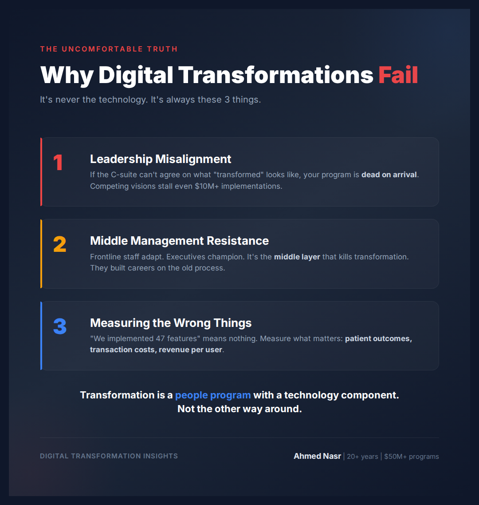

# Wednesday February 25 | TAM | PAS | Scary | CTA: A ✅ POSTED

---

Most digital transformations fail satisfying everyone.

And cost organizations millions.

I've led transformation programs totaling $50M+ across healthcare, fintech, and e-commerce.

Here's the uncomfortable truth most consultants won't tell you:

The technology is never the problem.

It's the 3 things nobody wants to fix:

1. Leadership alignment.
If the C-suite can't agree on what "transformed" looks like, your program is dead on arrival. I've seen $10M implementations stall because two VPs had competing visions.

2. Change resistance at the middle.
Frontline staff will adapt. Executives will champion. It's the middle management layer that kills transformation. They built their careers on the old process.

3. Measuring the wrong things.
"We implemented 47 features" means nothing. Did patient wait times drop? Did transaction costs decrease? Did revenue per user increase?

In my current role, I'm leading a digital transformation across a 15-hospital network spanning 3 countries. The hardest part isn't the AI, the EMR, or the data warehouse.

It's getting 15 different hospital cultures to move in the same direction.

The organizations that win at transformation are the ones that treat it as a people program with a technology component, not the other way around.

What's the biggest transformation blocker you've seen?

..

By the way, I'm currently exploring VP/C-suite digital transformation roles across the GCC. If your network is hiring leaders who've scaled platforms from 30K to 7M daily orders, I'd love to connect.

#DigitalTransformation #HealthcareIT #Leadership #PMO
