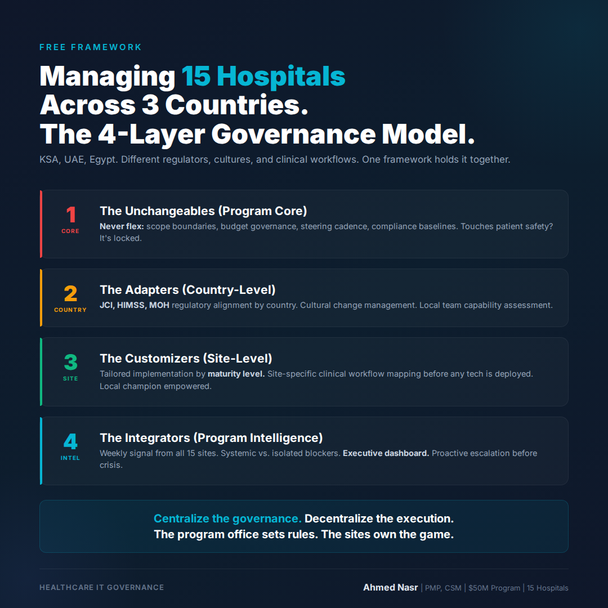

# Tuesday March 3 | Growth | PAS | Free Value | CTA: C

---

Managing hospitals across countries is breaking PMOs.
Here's the exact framework I use.

Most hospital transformation programs fail the same way.

Not because of bad technology.
Not because of budget overruns.
Not because of poor planning.

They fail because a framework designed for one entity gets force-applied to 15 different ones.

In my current role, I'm leading a digital transformation program across a 15-hospital network spanning 3 countries: KSA, UAE, and Egypt.

Each hospital has its own culture.
Each country has its own regulatory framework: JCI, HIMSS, MOH requirements that don't align cleanly.
Each clinical department has its own definition of "success."

Here's the 4-layer governance model that's holding it together:

**Layer 1: The Unchangeables (Program Core)**
These never flex, regardless of site or country.
Scope boundaries. Budget governance. Executive steering cadence. Compliance baselines.
If it touches patient safety or regulatory risk, it's locked.

**Layer 2: The Adapters (Country-Level)**
Regulatory alignment to local MOH requirements.
Stakeholder mapping by country.
Cultural protocols for change management.
Local team capacity and capability assessments.

**Layer 3: The Customizers (Site-Level)**
Each hospital gets a tailored implementation sequence.
Prioritization based on current maturity level, not a standardized roadmap.
Site-specific clinical workflow mapping before any technology is deployed.
Local champion identified and empowered before go-live.

**Layer 4: The Integrators (Program Intelligence)**
Weekly signal aggregation from all 15 sites.
Pattern recognition: which blockers are systemic vs. isolated?
Executive-level dashboard that separates noise from signal.
Proactive escalation before issues become crises.

The instinct with multi-site programs is to centralize control.
That's exactly wrong.

**Centralize the governance. Decentralize the execution.**

The program office sets the rules.
The sites own the game.

If you're managing a multi-site or multi-country program and you're fighting your own governance model, the problem usually lives in Layer 2.

Which layer is breaking down in your program right now?

..

By the way, I'm writing a series on PMO frameworks that actually work at scale. Follow me for weekly breakdowns from managing 300+ concurrent projects across 8 countries.

#PMO #HealthcareIT #DigitalTransformation #ProgramManagement #Governance
