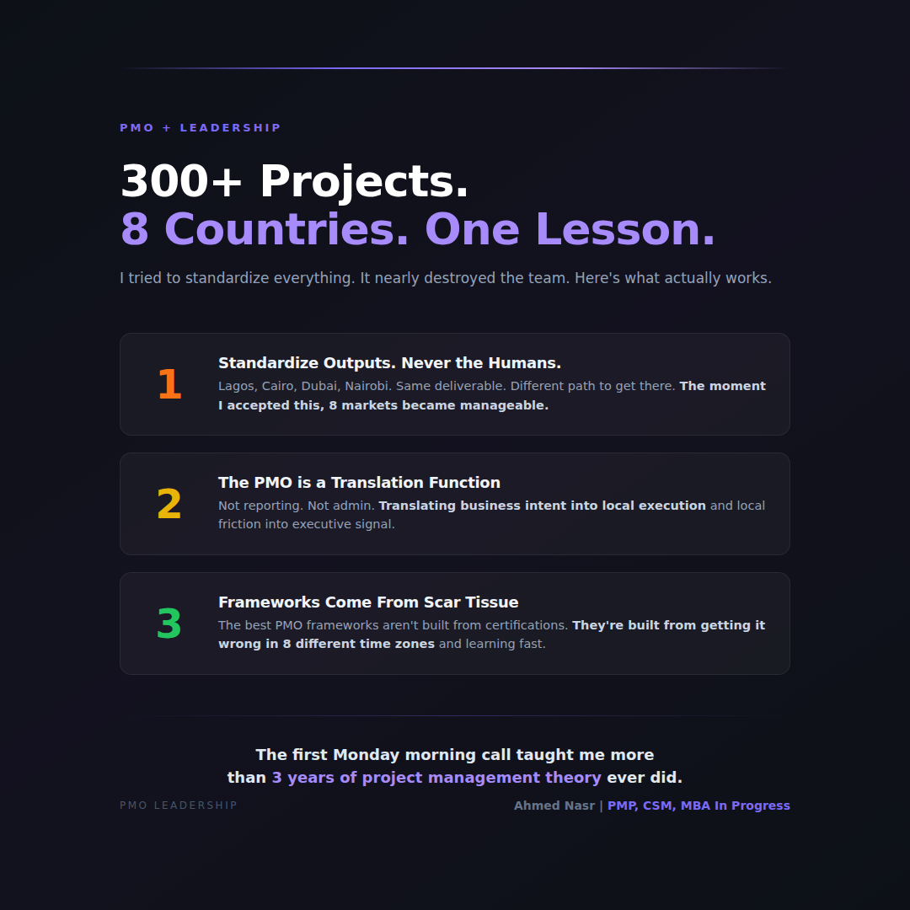

# Monday March 2 | Growth | SLAY | Strange | CTA: B

---

I built a PMO across 8 countries.
The hardest part wasn't the projects.

At Network International, I inherited a portfolio of 300+ banking and payments projects running across Egypt, UAE, Jordan, Kenya, Nigeria, Ghana, Mauritius, and South Africa.

300+ concurrent projects.
8 countries.
16 project managers I recruited and trained myself.
300+ banking clients worldwide.

You'd think the hard part was the complexity.

It wasn't.

**The hard part was the first Monday morning call.**

I had PMs in Lagos who worked differently from PMs in Nairobi.
I had clients in Dubai who communicated differently from clients in Cairo.
I had a governance model designed for one market trying to hold eight together.

Here's what I got wrong first:

I tried to standardize everything.

Same templates. Same reporting cadence. Same escalation path. Same everything.

It made sense on paper. It nearly destroyed the team.

What I learned over 3 years of figuring this out:

**Standardize the outputs. Never the humans.**

The deliverable looks the same in every country.
The path to get there is different in every country.

Lagos needed weekly check-ins. Cairo needed daily ones. Dubai needed the data, not the conversation.

Once I stopped treating 8 countries like one market with 8 offices, everything changed.

**The PMO stopped being a reporting function.**
It became a translation function.

Translating business intent into local execution.
Translating local friction into executive-level signal.
Translating 300+ competing priorities into a coherent portfolio.

The best PMO frameworks aren't built from certifications.
They're built from the scar tissue of getting it wrong in 8 different time zones.

What's the biggest misconception about PMO leadership you've seen?

..

By the way, I've been documenting my journey managing a $50M hospital transformation across 3 countries. If you're navigating a similar challenge, happy to share what's working. Drop a comment or DM.

#PMO #ProjectManagement #Leadership #Operations #GCC
