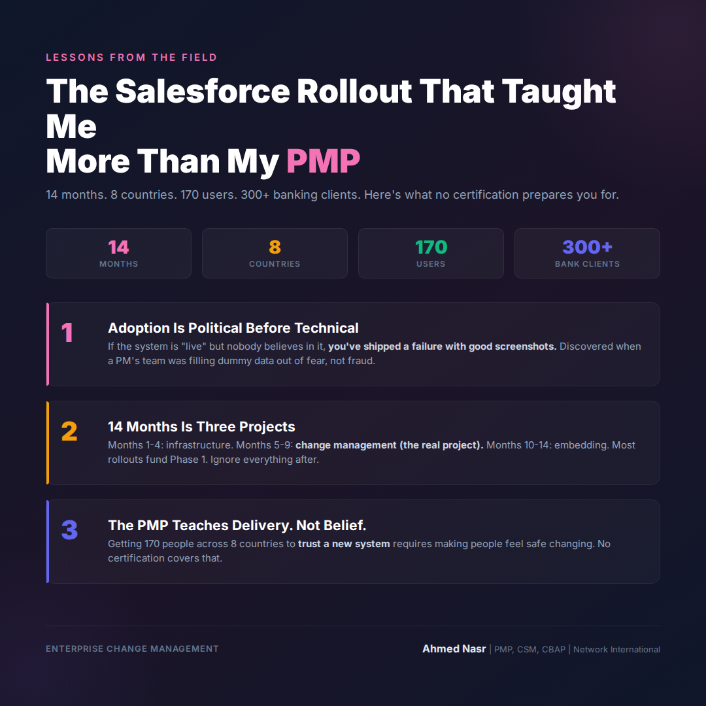

# Wednesday March 4 | Growth | SLAY | Strange | CTA: A

---

The Salesforce rollout taught me more than my PMP.
Nobody told me it would take 14 months.

When Network International handed me the keys to a Salesforce implementation, I thought I was ready.

PMP certified. CSM certified. CBAP certified. 300+ projects under my belt.

I was wrong.

This wasn't a project.
It was a 14-month organizational change program hiding inside a technology deployment.

**The scope:** Full Salesforce platform rollout. CRM, service management, client engagement.
**The footprint:** 8 countries. Egypt, UAE, Jordan, Kenya, Nigeria, Ghana, Mauritius, South Africa.
**The users:** 170 people across all of them.
**The client data:** 300+ banking institutions.

Week 3, I got my first real lesson.

A PM in Nairobi came to me privately. Her team had been filling in Salesforce records with dummy data to hit the go-live milestone.

Not fraud. Fear.
Fear that non-adoption would reflect badly on them personally.

That one conversation restructured everything I thought I knew about enterprise software rollouts.

**Lesson 1: Adoption is a political problem before it's a technical one.**
If the system is "live" but nobody believes in it, you've shipped a failure with good screenshots.

**Lesson 2: 14 months is actually multiple projects.**
Months 1-4: Infrastructure and configuration.
Months 5-9: Change management (the real project).
Months 10-14: Embedding and behavioral shift.
Most rollouts fail because they fund Month 1-4 and ignore everything after.

**Lesson 3: The PMP teaches you to deliver projects.**
Nobody teaches you to deliver belief.

Getting 170 people across 8 countries to trust a new system requires something no certification gives you: the ability to make people feel safe changing.

The best implementations I've seen don't celebrate go-live.
They celebrate first real adoption 90 days after.

What was the moment that changed how you think about enterprise software rollouts?

..

By the way, I'm currently exploring VP/C-suite digital transformation roles across the GCC. If your network is hiring leaders who've scaled platforms from 30K to 7M daily orders, I'd love to connect. DM me or check my profile.

#Salesforce #ChangeManagement #PMO #Leadership #EnterpriseIT
