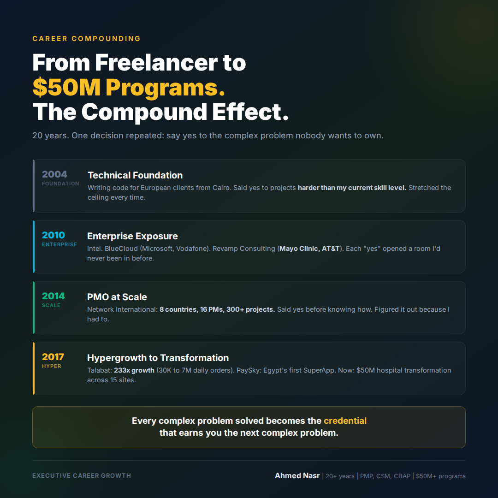

# Thursday March 5 | Sales | SLAY | Sexy | CTA: B

---

From freelancer to $50M programs.
The compound effect of saying yes to complexity.

In 2004, I was writing code for European clients from Cairo.
Per-project. Per-feature. Whatever came through the door.

By 2014, I was running a PMO across 8 countries managing 300+ concurrent banking projects.

By 2024, I was leading a $50M digital transformation across 15 hospitals in 3 countries.

The gap between 2004 and 2024 wasn't luck.
It wasn't a single career-defining moment.
It was a pattern of one specific decision, made over and over:

**Say yes to the complex problem nobody wants to own.**

Here's how the compounding worked:

**2004-2009: Technical foundation.**
I said yes to projects that were technically harder than my current skill level. Code Republic, PEARDEV, early SaaS development for European clients. Each one stretched the ceiling.

**2010-2013: Enterprise exposure.**
I said yes to Intel. Then BlueCloud managing Microsoft and Vodafone accounts. Then Revamp Consulting with Mayo Clinic and AT&T. Each "yes" opened a room I'd never been in before.

**2014-2017: Scale.**
Network International. 8 countries. 16 PMs. 300+ projects. I said yes before I knew exactly how to do it. I figured it out because I had to.

**2017-2024: Hypergrowth to transformation.**
Talabat: 233x growth. PaySky: Egypt's first SuperApp. Then a $50M hospital network transformation that's still running.

The compounding secret isn't "work harder."

It's: **Every complex problem you solve becomes the credential that earns you the next complex problem.**

Most people wait until they feel ready.
Ready doesn't come before the complex problem.
It comes because of it.

The question I ask myself before saying yes to something hard: "Will solving this open a door I couldn't see from here?"

If yes, I say yes.

What was the complexity you said yes to that changed your trajectory?

..

By the way, I've been documenting my journey managing a $50M hospital transformation across 3 countries. If you're navigating a similar challenge, happy to share what's working. Drop a comment or DM.

#CareerGrowth #Leadership #DigitalTransformation #PMO #ExecutiveLife
