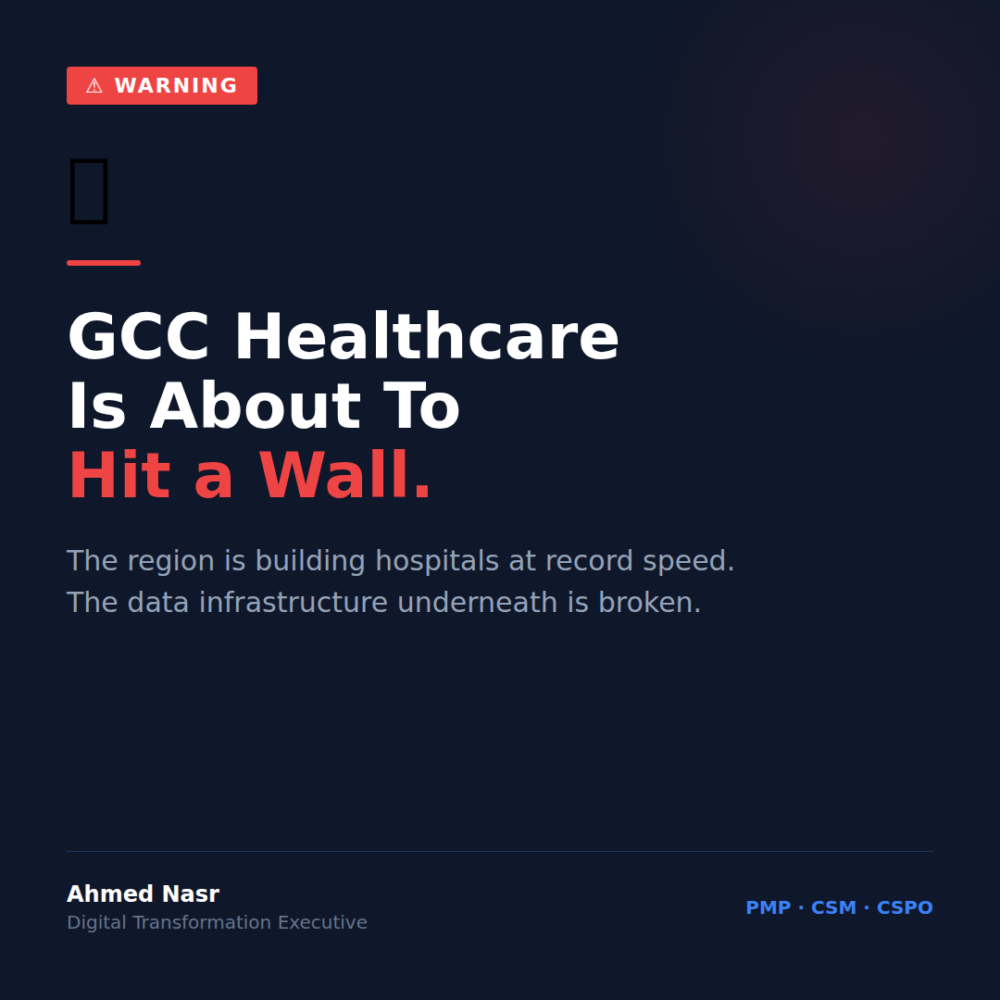

# Sunday March 9 | TAM | PAS | Scary | CTA: A

---

GCC healthcare is about to hit a wall.
Here's why.

The region is building hospitals at record speed.
Saudi Vision 2030. UAE Health Strategy. Qatar National Health Strategy.

Billions committed.
Hundreds of new facilities planned.

But here's the problem nobody wants to say out loud:

**The infrastructure underneath those hospitals is broken.**

Not the buildings.
Not the equipment.
Not the staff.

The data.

Right now, across the GCC, most hospitals are running clinical systems that don't talk to their financial systems.
Financial systems that don't talk to operational ones.
And operational ones that were never designed to handle scale.

You can open a 500-bed hospital in six months.
You cannot fix a fragmented data architecture in six months.

Here's what this actually looks like on the ground:

A patient gets admitted to hospital A.
Transferred to hospital B in the same network.
Hospital B has zero access to that patient's clinical history.

A CFO wants to know the real cost per patient episode.
Three systems. Three exports. A spreadsheet. Two weeks.

An operations team wants to reduce readmissions.
The data exists. In four different places. In three different formats.

**The wall isn't coming. It's already here.**

The GCC is spending on capacity.
It has underinvested on capability.

I've been managing a $50M digital transformation across 15 hospitals and 3 countries.
The hardest part wasn't the hospitals.
It was convincing people that buying new technology doesn't fix old data problems.

The regions that will win in the next decade of healthcare aren't the ones with the most beds.
They're the ones with the cleanest data.

Are you seeing this same gap in your market?

..

By the way, I'm currently exploring VP/C-suite digital transformation roles across the GCC. If your network is hiring leaders who've scaled platforms from 30K to 7M daily orders, I'd love to connect. DM me or check my profile.

#HealthcareIT #GCCHealthcare #DigitalTransformation #HealthTech #Vision2030
