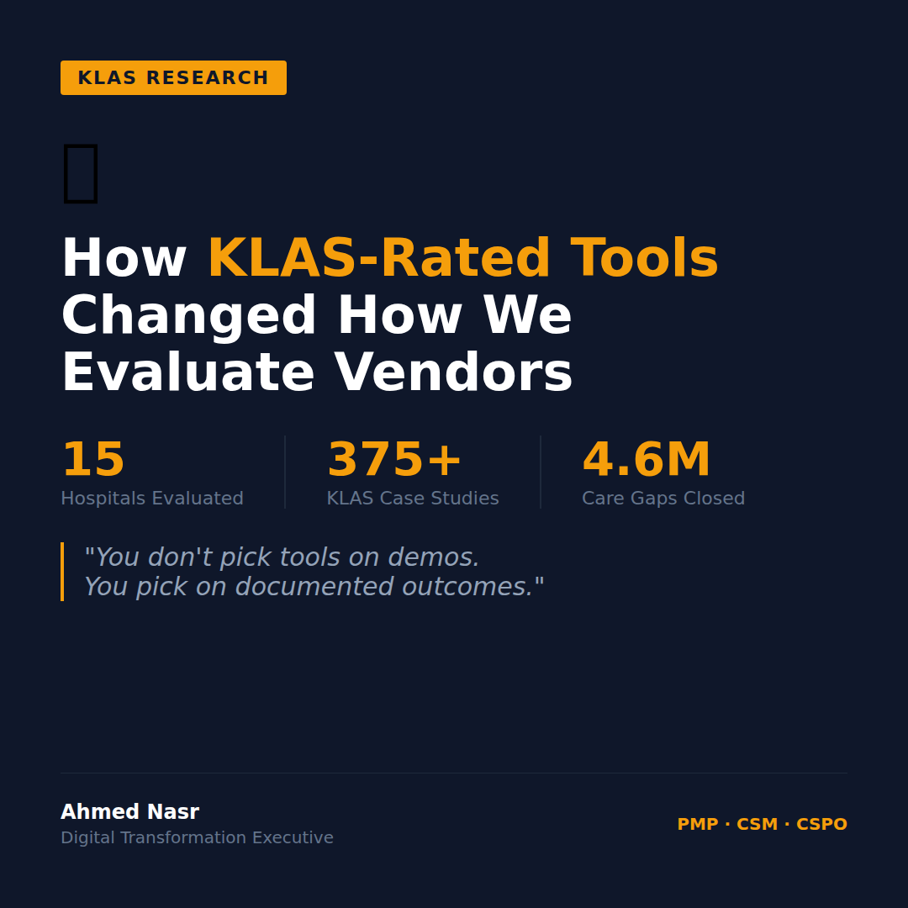

# Thursday March 12 | Growth | SLAY | Sexy | CTA: A

---

Before we buy any healthcare IT tool, we check one thing.
KLAS rating.

Full stop.

We manage 15 hospitals across 3 countries.
Every vendor walks in with a polished demo and a 50-page deck.

Here's what changed how we evaluate all of them:

**KLAS doesn't ask vendors what they do.**
**It asks hospitals what actually happened.**

That's the difference.

When I started this role, vendor selection was mostly demos, references from the vendor's own happy clients, and gut feel.

Then I started working with KLAS Research.

375+ case studies from real hospital deployments.
Ratings from the nurses, the clinicians, the IT staff who live inside these systems every day.
Not the CIO who bought it. The people who have to use it at 2am.

That changed everything.

Here's what we now look for in a KLAS review:

1. **Implementation experience score.** Not just the product, how painful was the rollout?
2. **Customer support responsiveness.** What happens when something breaks at midnight?
3. **Outcomes documentation.** Did similar hospitals actually achieve what was promised?
4. **Replacement risk.** Is this vendor losing clients or keeping them?

We evaluated one platform that demo'd beautifully.
KLAS showed a 62% client retention rate and multiple notes about implementation delays.

We passed. Six months later, two hospitals in our network that had gone ahead with them were struggling.

You don't pick tools on demos.
You pick on documented outcomes from people who have no incentive to lie.

**The best purchasing decision I've made wasn't a decision.**
It was a framework change.

What's your vendor evaluation process look like?

..

By the way, I'm currently exploring VP/C-suite digital transformation roles across the GCC. If your network is hiring leaders who've scaled platforms from 30K to 7M daily orders, I'd love to connect. DM me or check my profile.

#HealthcareIT #KLAS #VendorManagement #DigitalHealth #PMO
