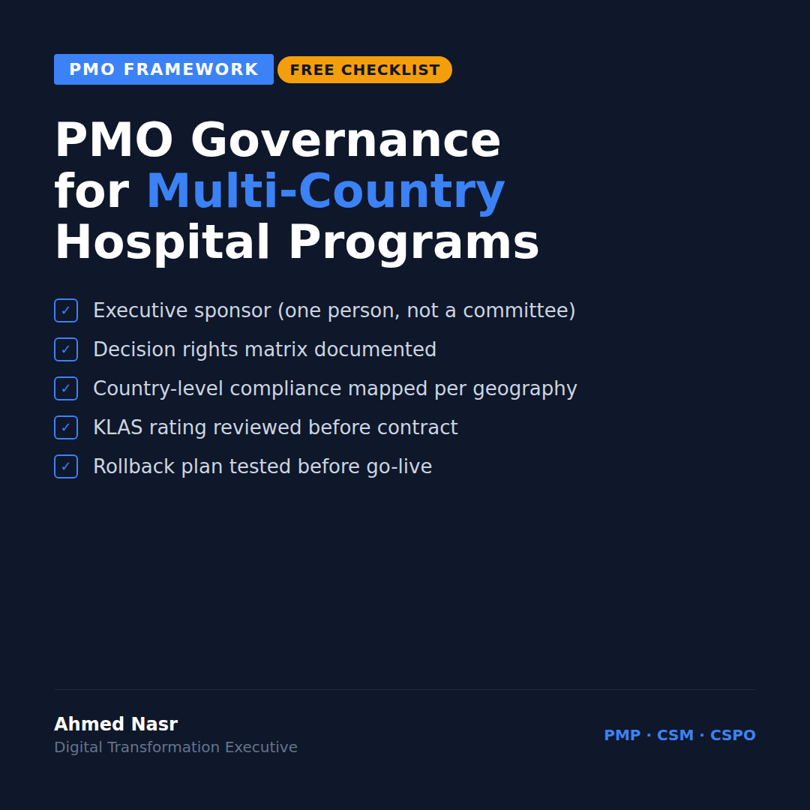

# Wednesday March 11 | Growth | PAS | Free Value | CTA: C

---

Most multi-country hospital PMOs fail in the first 90 days.
Not because of the technology.

Because nobody defined governance before the chaos started.

I've managed $50M in digital transformation across 15 hospitals in 3 countries.
This is the checklist I wish I had on day one.

**PMO Governance Checklist for Multi-Country Hospital Programs**

Copy it. Use it. Adapt it for your context.

---

**Before You Start**

- [ ] Single executive sponsor identified (not a committee, one person)
- [ ] Decision rights matrix documented: who approves, who consults, who is informed
- [ ] Country-level PMO lead appointed per geography
- [ ] Escalation path defined before the first issue arrives
- [ ] Communication cadence agreed: daily standup, weekly steering, monthly board

---

**Data & Reporting**

- [ ] Unified project dashboard (not three separate spreadsheets)
- [ ] RAG status definitions agreed and locked (Red/Amber/Green means the same thing in every country)
- [ ] Financial reporting currency and cadence fixed
- [ ] Compliance checkpoints mapped per country (Saudi MOH, UAE DHA, JCI, etc.)

---

**Stakeholder Management**

- [ ] Clinical champion identified at each site
- [ ] IT lead AND operations lead at each site (you need both)
- [ ] Resistance mapping done before go-live, not after
- [ ] Change management owner separate from project manager

---

**Vendor Management**

- [ ] KLAS rating reviewed before contract
- [ ] SLA definitions specific to each country's compliance requirements
- [ ] Escalation contact (not just account manager) per vendor
- [ ] Exit criteria defined before signing

---

**Go-Live Readiness**

- [ ] Staff training tracked per role, not just per site
- [ ] Parallel run period defined (minimum 2 weeks)
- [ ] Rollback plan documented and tested
- [ ] Post go-live support window confirmed in writing

---

This isn't theory.
Every item on this list came from something that broke.

What's missing from your governance checklist?

..

By the way, I'm writing a series on PMO frameworks that actually work at scale. Follow me for weekly breakdowns from managing 300+ concurrent projects across 8 countries.

#PMO #ProjectManagement #HealthcareIT #GCC #HospitalTransformation
