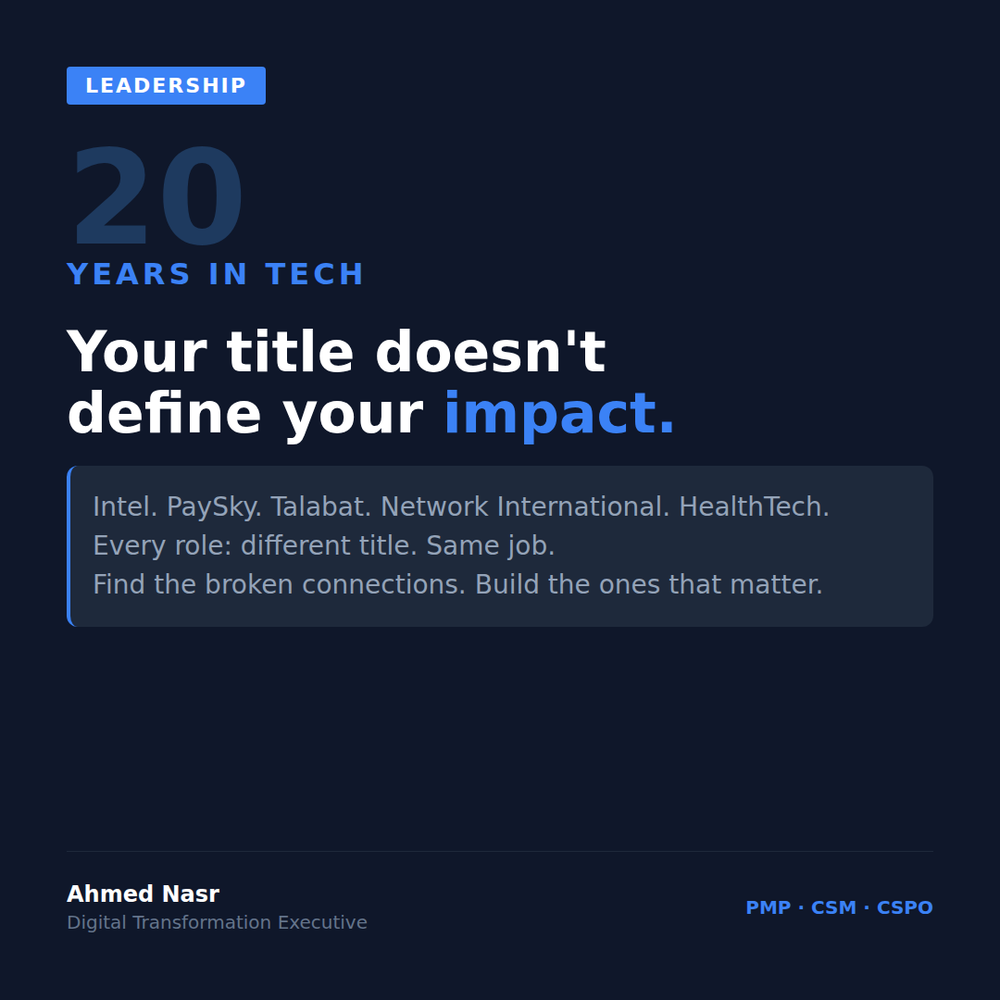

# Monday March 17 | Growth | SLAY | Sexy | CTA: A

---

20 years in tech taught me one thing.
Your title doesn't define your impact.

I've had titles that sounded impressive and did nothing.
I've had titles that sounded small and changed everything.

Here's what actually defines impact:

**Story**

When I joined a hospital network as Acting PMO and Regional Engagement Lead, I wasn't the CEO.
I wasn't even in the C-suite.

But I was managing $50M in transformation across 15 hospitals in 3 countries.
I had 3 EMR systems that didn't talk to each other.
I had country-level compliance requirements that contradicted each other.
I had clinical teams that had never been asked what they needed before a system was bought for them.

Nobody handed me authority.
I built it.

Meeting by meeting.
Problem by problem.
Outcome by outcome.

**Lesson**

Impact isn't assigned with a title.
It's built through clarity when everyone else is confused.
It's built through decisions when everyone else is waiting.
It's built through accountability when everyone else is pointing fingers.

**Action**

Three questions I ask myself before any new role:
1. What decisions can I make without asking?
2. Who will I be able to move in the next 90 days?
3. What would success look like if my title didn't exist?

If the answers are small, the impact will be small.
Regardless of the job description.

**You**

A VP who can't make decisions is less impactful than a Team Lead who can.

The most powerful person in any organization isn't the one at the top of the org chart.

It's the one everyone calls when something actually needs to get done.

What title vs. impact gap have you seen in your career?

..

By the way, I'm currently exploring VP/C-suite digital transformation roles across the GCC. If your network is hiring leaders who've scaled platforms from 30K to 7M daily orders, I'd love to connect. DM me or check my profile.

#Leadership #CareerGrowth #DigitalTransformation #ExecutiveLeadership #GCC
