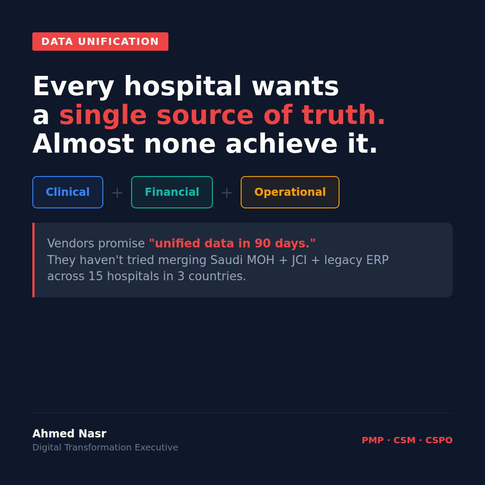

# Tuesday March 18 | Growth | PAS | Scary | CTA: B

---

Every hospital says they want a single source of truth.
Almost none achieve it.

Here's what nobody tells you before you start.

**The Problem**

It sounds clean in the boardroom.
"Unified clinical, financial, and operational data."

The CIO nods. The CFO nods. The CMO nods.

Then you go to actually build it.

And you realize: you have 15 hospitals.
3 EMR systems.
Each country has its own compliance requirements: Saudi MOH, JCI standards, UAE DHA reporting.
Legacy ERP that was last upgraded in 2014.
Financial data in one currency format.
Clinical data in two different coding standards.
Operational data that lives in someone's Excel file on a shared drive.

**The Agitation**

Vendors walk in and say "unified data in 90 days."

They haven't tried merging Saudi MOH reporting requirements with JCI accreditation data with a legacy ERP that doesn't have an API.

They haven't dealt with a clinical team in one country that has been using one patient ID format for 10 years and a financial team in another country using a different one.

They haven't had the conversation where you find out that "operational data" in hospital A means bed management, and in hospital B it means pharmacy stock.

90 days becomes 9 months.
9 months becomes a boardroom question about why nothing is working.

**The Solution**

Here's what actually works:

1. Start with the reporting layer, not the data layer. Agree on what the output looks like before you touch the source systems.
2. Assign data ownership per domain. Clinical data has an owner. Financial has an owner. Operational has an owner.
3. Build the compliance map before you build the integration. Each country has different rules on what data can move where.
4. Accept that "unified" doesn't mean "identical." The goal is a common view, not a common database.
5. Pick one use case and make it work completely. Then expand. Not the other way around.

The single source of truth is achievable.
Just not in 90 days.
And not without a leader who's willing to say the hard things early.

What's the most painful data unification challenge you've faced?

..

By the way, I've been documenting my journey managing a $50M hospital transformation across 3 countries. If you're navigating a similar challenge, happy to share what's working. Drop a comment or DM.

#HealthcareIT #DataStrategy #DigitalHealth #HospitalTransformation #PMO
